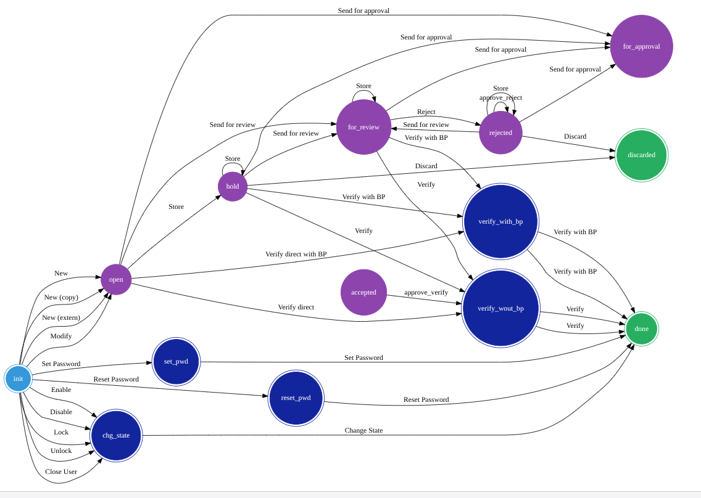

# :gem: Workflow Visualizer

Copy & paste workflow declaration as wfd source and visualize it in the browser. Download PNG if needed.

## :bulb: Getting Started

Download the index.html file and open it in a browser.
